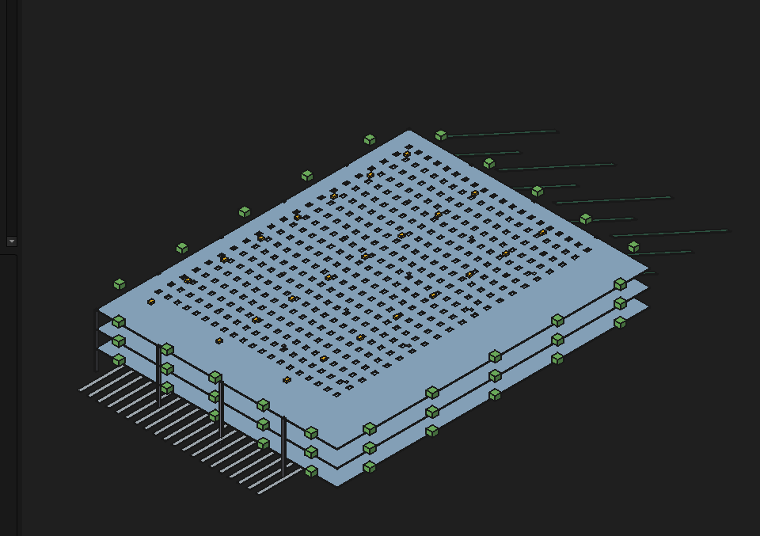
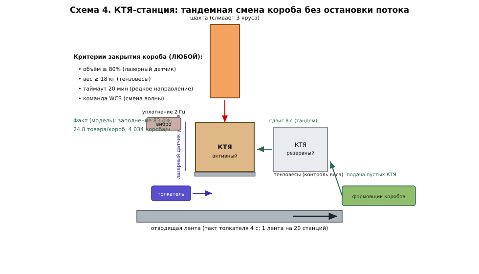
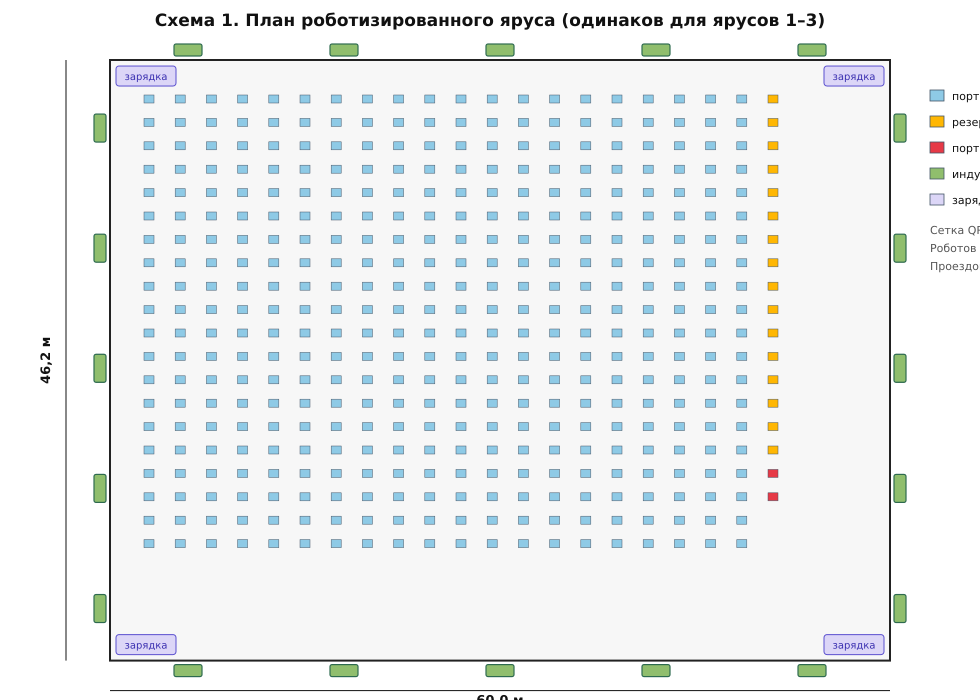
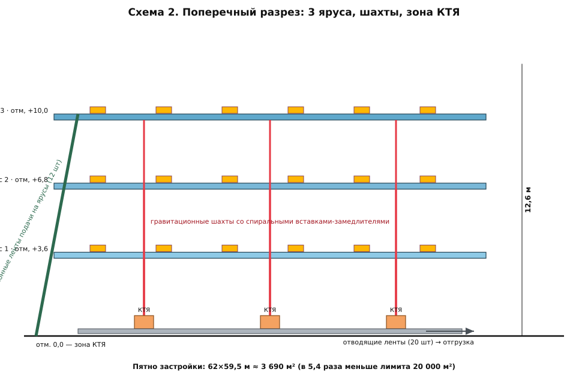

# АСР-100/400 «Рой»

**Автоматизированный сортировщик: 100 000 товаров/час · 400 направлений ·
укладка в КТЯ · площадь 3 690 м² (18 % от лимита).**











Хакатон Ozon Tech «Робозон» · Задача 2 · Команда **«Ящик Шрёдингера»**

Решение: три роботизированных яруса над зоной коробов — 1 380 мобильных
роботов с наклонными лотками сбрасывают товары в порты-шахты; шахты трёх
ярусов сливаются в 416 КТЯ-станций с тандемной сменой коробов.
Подтверждение — имитационная модель (SimPy), валидированная независимым
аналитическим расчётом (отклонения ≤ 3,3 %), 8 сценариев включая отказы.

```
номинал 100 024 шт/ч (8 ч) · p95 = 49 с · точность 99,958 %
заполнение КТЯ 83,4 % · 607 кВт (5,9 Вт·ч/товар) · предел ≈ 109 000 шт/ч
```

---

## Навигация по материалам

| Документ | Что внутри |
|---|---|
| **[REPORT.md](REPORT.md)** | полный технический отчёт: архитектура, расчёты, нештатные режимы, валидация, критерии |
| [slides/PRESENTATION.md](slides/PRESENTATION.md) | презентация (12 слайдов) + сценарий видео ≤ 7 мин |
| [docs/schemes/](docs/schemes/) | 5 инженерных схем (SVG): план яруса, разрез, робот, КТЯ-станция, управление |
| [docs/alternatives.md](docs/alternatives.md) | расчёты отвергнутых альтернатив (кросс-белт и др.) |
| [docs/capex_opex.md](docs/capex_opex.md) | оценка затрат и себестоимости сортировки |
| [results/](results/) | итоги 8 сценариев, `summary_all.md`, `validation.md`, графики `plots/*.png` |
| [sim/](sim/) | имитационная модель: `config.py` (все параметры), `model.py`, `analytic.py` |
| [wms/](wms/) | mock внешней WMS + сквозной тест сетевой интеграции |
| [cad/generate_layout.py](cad/generate_layout.py) | параметрическая 3D-компоновка для FreeCAD (STEP-экспорт) |

Объёмные артефакты (видео демонстрации, STEP/рендеры CAD):
**S3-бакет** — `https://storage.yandexcloud.net/robozon-shrodinger-box/`
(ссылки продублированы в конце этого файла).

---

## Быстрый старт

Требования: **Python ≥ 3.10** (проверено на 3.12), ОС любая.
Модель работает даже без зависимостей (встроенный мини-движок DES);
с установленным SimPy используется SimPy.

```bash
# 1) базовый сценарий: 8 ч модельного времени, ~40 с реального
python3 sim/run.py S0_base

# 2) полная верификация: 8 сценариев + валидация + графики (~3 мин)
pip install -r requirements.txt      # simpy, matplotlib, pandas, streamlit
python3 sim/run_all.py

# 3) сетевое взаимодействие с внешней WMS (обязательное требование):
python3 wms/demo_integration.py      # поднимет mock-WMS и прогонит модель по HTTP

# 4) интерактивный дашборд результатов
streamlit run app.py                 # http://localhost:8501
```

### Docker (полная воспроизводимость)

```bash
docker compose run sim               # все сценарии -> ./results
docker compose up wms dashboard      # mock-WMS :8008 + дашборд :8501
```

### Сценарии

`S0_base` · `S1_peak15` (+15 % на час) · `S2_robots5` (−5 % роботов) ·
`S3_ports10` (отказ 10 портов) · `S4_tier_down` (останов яруса 30 мин) ·
`S5_induct6` (−6 индукций) · `S6_skew` (сильный перекос спроса) ·
`S7_stress120` (поиск предела). Параметры любого сценария:
`python3 sim/run.py S1_peak15 --hours 6 --seed 7`.

---

## Структура репозитория

```
├── README.md                  ← вы здесь (корневой документ)
├── REPORT.md                  ← технический отчёт
├── app.py                     ← Streamlit-дашборд
├── requirements.txt / Dockerfile / docker-compose.yml / Makefile
├── sim/
│   ├── config.py              ← ВСЕ инженерные параметры + сценарии
│   ├── model.py               ← имитационная модель (DES)
│   ├── engine.py              ← резервный мини-движок с API SimPy
│   ├── analytic.py            ← независимый расчёт для валидации
│   ├── run.py / run_all.py    ← запуск сценария / всей верификации
│   └── wms_client.py          ← HTTP-клиент WMS
├── wms/
│   ├── mock_wms.py            ← имитация внешней WMS (stdlib, без зависимостей)
│   └── demo_integration.py    ← сквозной сетевой тест
├── docs/
│   ├── make_schemes.py        ← генератор схем
│   ├── schemes/*.svg          ← 5 инженерных схем
│   ├── alternatives.md        ← анализ альтернатив
│   └── capex_opex.md          ← экономика
├── cad/generate_layout.py     ← FreeCAD-макрос (3D-компоновка, STEP)
├── slides/PRESENTATION.md     ← презентация + сценарий видео
└── results/                   ← результаты прогонов (генерируются)
```

## Версии ПО

| ПО | Версия | Назначение |
|---|---|---|
| Python | 3.12 (мин. 3.10) | модель, аналитика, WMS |
| SimPy | 4.1.1 | дискретно-событийное моделирование |
| NumPy / Pandas | 2.2.6 / 2.3.3 | обработка результатов |
| Matplotlib | 3.10.6 | графики |
| Streamlit | 1.45.0 | дашборд |
| Docker / Compose | 24+ / v2 | воспроизводимость |
| FreeCAD | 0.21.2+ | 3D-компоновка (опционально) |

Воспроизводимость: фиксированные seed на сценарий; версии закреплены в
`requirements.txt`; контейнер не требует сети после сборки.

## Артефакты в S3

* Видео демонстрации (≤ 7 мин): `.../video/robozon_task2_demo.mp4`
* CAD: `.../cad/asr100_400.step`, рендеры `.../cad/renders/`
* Архив результатов полного прогона: `.../results/results_full.zip`

## Команда

**«Ящик Шрёдингера»** — Мовсар Зангиев (капитан, архитектура и модель),
Медина Зангиева (документация и схемы), Муслим Зангиев (сценарии и
верификация).
